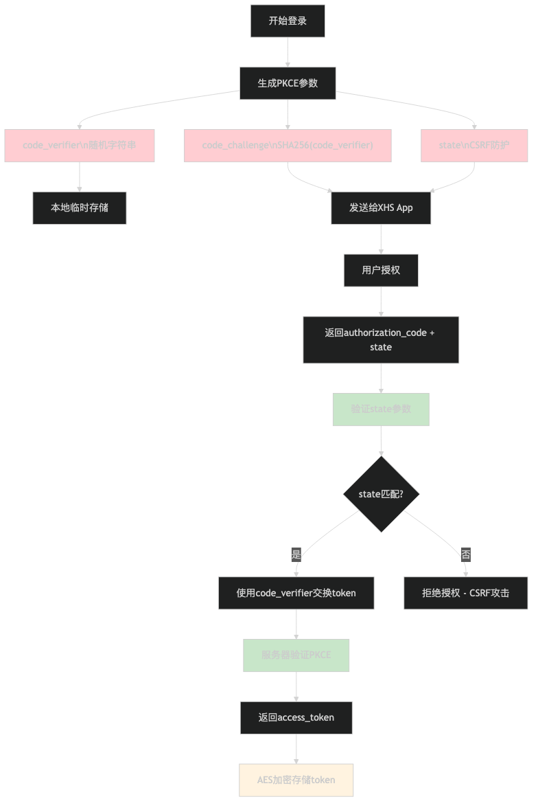
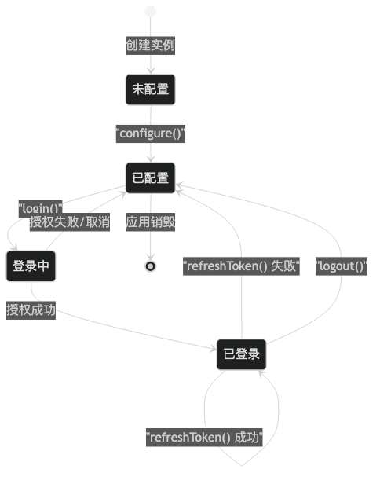

# 小红书 OAuth Login SDK 交互流程图

## 1. 整体架构图

## 2. 完整OAuth授权流程

## 3. 核心组件交互图

## 4. App-to-App通信流程

## 5. 安全机制流程图

## 6. 错误处理流程

## 7. 存储加密流程

## 8. SDK生命周期管理

## 关键设计说明

### PKCE安全增强
- 每次授权生成唯一的`code_verifier`和`code_challenge`
- 防止授权码拦截攻击，提升OAuth安全性

### App-to-App通信
- 使用ComponentName精确定位小红书OAuth Activity
- 通过Intent Extra传递结构化数据（Parcelable）
- XHSEntryActivity作为回调接收器处理授权结果

### 本地存储安全
- 使用AES加密存储所有敏感信息
- 设备相关密钥，提升数据安全性
- 支持清空所有用户数据（logout）

### 错误处理策略
- 分层错误处理：网络层、业务层、UI层
- 结构化错误码便于问题定位和用户体验优化
- 主线程回调确保UI操作安全性